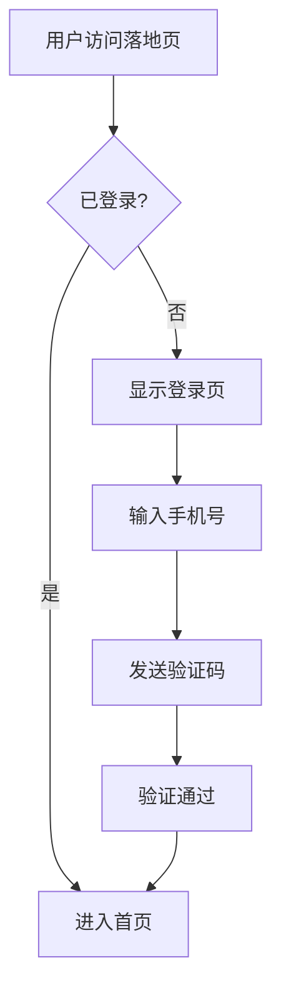
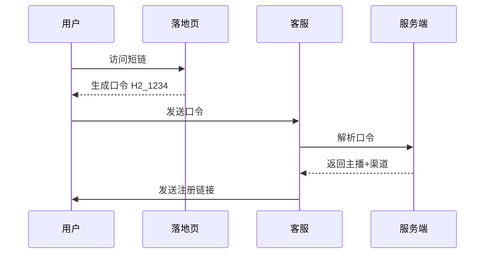
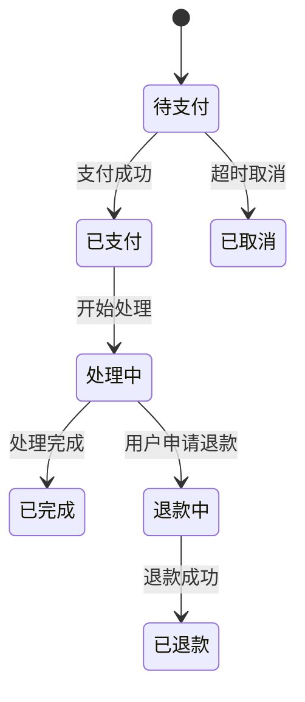
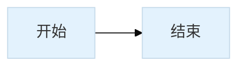

# 项目文档规范 (Documentation Standards)

> **文档状态**: 已完成  
> **更新日期**: 2026-04-08

---

## 1. 流程图规范

### 1.1 使用 Mermaid 绘制流程图

所有流程图必须使用 **Mermaid** 语法，禁止使用 ASCII 字符画。

### 1.2 流程图类型选择

| 场景 | 图表类型 | 语法 |
|------|----------|------|
| 业务流程 | 流程图 | `flowchart TD/LR` |
| 时序交互 | 时序图 | `sequenceDiagram` |
| 状态转换 | 状态图 | `stateDiagram` |
| 实体关系 | 实体关系图 | `erDiagram` |

### 1.3 流程图示例

**业务流程 - 用户注册**



**时序图 - 客服对话流程**



**状态图 - 订单状态**



### 1.4 样式规范

**节点样式**:
- 开始/结束节点: 圆形 `([文本])`
- 处理节点: 矩形 `[文本]`
- 判断节点: 菱形 `{文本}`
- 子流程: 双矩形 `[[文本]]`

**颜色主题**（可选）:


### 1.5 命名规范

| 元素 | 命名规则 | 示例 |
|------|----------|------|
| 节点ID | 大写字母/数字 | `A`, `B1`, `StartNode` |
| 节点文本 | 中文，简洁明了 | `[用户登录]`, `{验证通过?}` |
| 连接线 | 描述动作 | `-->|点击按钮|`, `-->|提交表单|` |

---

## 2. PRD 文档结构

### 2.1 必需章节

```markdown
# 功能名称 PRD

> **文档状态**: 草稿/评审中/已完成  
> **更新日期**: YYYY-MM-DD  
> **关联项目**: 项目编号

---

## 1. 流程概览
[使用 Mermaid 流程图]

## 2. 功能详细设计

### 2.1 子功能A
[详细描述 + 流程图/时序图]

### 2.2 子功能B
[详细描述 + 流程图/时序图]

## 3. 数据设计
[字段表格，禁止 SQL 代码]

## 4. 异常处理
[异常场景表格]

## 5. 话术模板（如有）
[双语话术]

---

## 变更记录
| 版本 | 日期 | 变更 |
|------|------|------|
| v1.0 | YYYY-MM-DD | 初始版本 |
```

### 2.2 禁止事项

| ❌ 禁止 | ✅ 替代方案 |
|--------|-------------|
| ASCII 流程图 | Mermaid 流程图 |
| **任何代码实现**（Python/JS/SQL等） | **纯逻辑描述**（步骤、条件、映射关系） |
| SQL 建表语句 | 字段说明表格 |
| 界面原型截图 | 文字描述 + ASCII 简单示意 |

### 2.3 开发部分写作原则

**只讲逻辑，不讲实现**:

| ❌ 错误写法 | ✅ 正确写法 |
|-------------|-------------|
| 使用 `split('_')` 方法拆分字符串 | 查找 `_` 分隔符，拆分为口令和身份码两部分 |
| 调用 `query("SELECT * FROM...")` | 查询该IP最近30分钟的访问记录 |
| 定义 `function parseCode()` | 描述解析步骤：1.检查分隔符 2.验证格式 3.映射编码 |
| 使用 `if (code.length === 2)` | 验证口令为2位字符 |

**核心原则**:
- 描述「做什么」而不是「怎么做」
- 使用自然语言描述逻辑步骤
- 可用表格列出映射关系、判断条件、字段说明
- 禁止出现具体编程语言语法、函数定义、SQL语句

---

## 3. 参考文档

- [Mermaid 官方文档](https://mermaid.js.org/)
- [Mermaid Live Editor](https://mermaid.live/)

---

**文档版本**: v1.0  
**创建日期**: 2026-04-08
