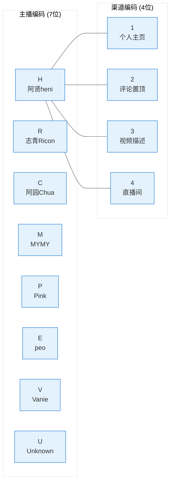
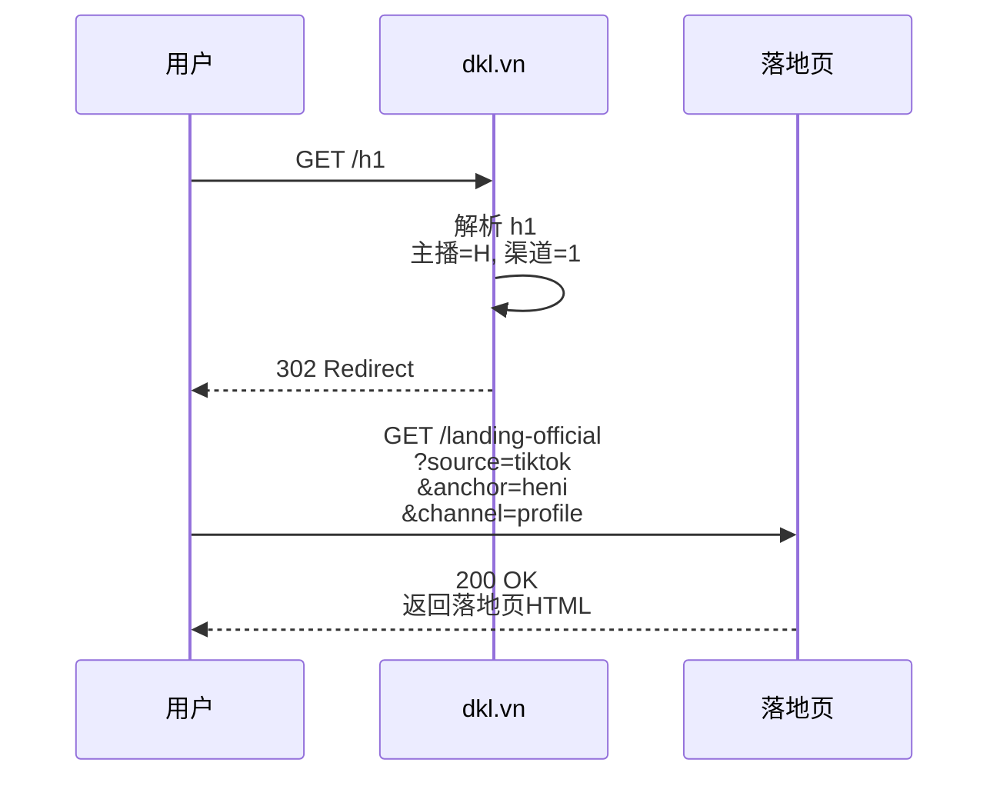
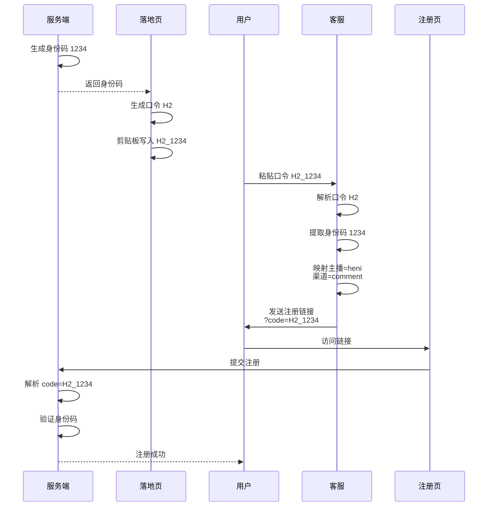
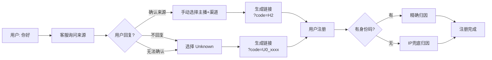
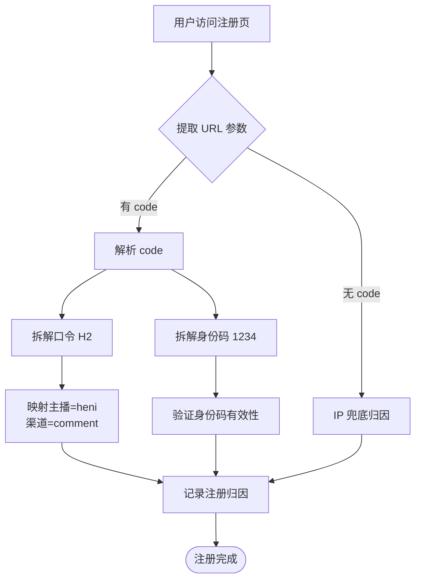

# TK 引流到注册完整链路 PRD

> **文档状态**: 已完成  
> **更新日期**: 2026-04-08  
> **关联项目**: 001-growNewUsers/001-03-landing-page  

---

## 1. 流程概览

```mermaid
flowchart TD
    Start([TK Bio/评论区/直播间]) --> ShortLink[短链跳转<br/>dkl.vn/{主播}{渠道}]
    ShortLink --> Landing[落地页 Webview]
    
    Landing --> Identity[生成身份码<br/>H2_1234]
    Identity --> Clipboard[剪贴板写入<br/>H2_1234]
    Clipboard --> Zalo{Zalo 调起}
    
    Zalo -->|✅ 成功| AddCS[添加客服]
    Zalo -->|❌ 失败| CopyZalo[复制 Zalo 号<br/>手动打开]
    CopyZalo --> AddCS
    
    AddCS --> CS[客服对话]
    CS --> Ask[索要口令 H2_1234]
    
    Ask -->|用户提供| Parse[解析口令<br/>生成链接]
    Ask -->|不提供| Unknown[手动选择 Unknown]
    
    Parse --> Register[注册页<br/>?code=H2_1234]
    Unknown --> Register
    
    Register --> Server[服务端解析 code]
    Server --> Attribution[归因到主播+渠道]
    Attribution --> Success([注册成功])
```

---

## 2. 短链系统

### 2.1 编码规则



**编码格式**: `{主播字母}{渠道数字}`

### 2.2 示例短链

| 短链 | 解析 | 使用场景 |
|------|------|----------|
| dkl.vn/h1 | 阿贤heni _ 主页 | Bio链接 |
| dkl.vn/h2 | 阿贤heni _ 评论 | 评论区置顶 |
| dkl.vn/r1 | 志青Ricon _ 主页 | Bio链接 |
| dkl.vn/m2 | MYMY _ 评论 | 评论区置顶 |

### 2.3 跳转目标



---

## 3. 落地页

### 3.1 核心功能

| 功能 | 实现 | 备注 |
|------|------|------|
| **身份码生成** | **服务端生成**4位随机数字，与口令绑定 | 用户访问时生成，需复制给客服 |
| **口令生成** | 页面加载时自动生成 | 格式: {主播字母}{渠道数字} |
| **剪贴板写入** | 自动复制"口令_身份码" | 如: H2_1234 |
| **剪贴板兜底** | 失败时弹窗展示口令_身份码 | 可一键复制 |
| **Zalo调起** | zalo://qr?... | 支持 iOS/Android |
| **复制Zalo号** | 备用方案 | 调起失败时使用 |

### 3.2 剪贴板内容格式

```
H2_1234
```

- 对用户而言是**统一口令**，格式为 `口令_身份码`
- 客服工具可解析拆分，但用户只需复制整体发送

### 3.3 剪贴板失败兜底弹窗

```
┌─────────────────────────────────────────┐
│ ⚠️ 复制失败                             │
│                                         │
│ 请手动复制下方口令：                     │
│ ┌───────────────────────────────────┐  │
│ │ H2_1234                           │  │
│ └───────────────────────────────────┘  │
│                                         │
│ [复制口令] [打开Zalo]                  │
│                                         │
│ 💡 添加好友后发送此口令领取礼包！        │
└─────────────────────────────────────────┘
```

### 3.4 事件埋点

| 事件名 | 触发时机 | 携带参数 |
|--------|----------|----------|
| page_view | 页面加载 | ref, source, anchor, channel |
| identity_code_generated | 身份码生成 | identity_code, ref |
| clipboard_write_attempt | 尝试写入剪贴板 | code, identity_code |
| clipboard_write_success | 剪贴板写入成功 | code, identity_code |
| clipboard_write_fail | 剪贴板写入失败 | code, identity_code |
| zalo_launch_attempt | 点击调起 | ref, webview_type |
| zalo_launch_success | 调起成功 | ref, time_to_success |
| copy_number | 点击复制Zalo号 | ref, method |

---

## 4. Zalo 客服流程

### 4.1 正常流程（用户提供口令_身份码）



### 4.2 兜底流程（用户未发口令/身份码）



### 4.3 客服工具输入要求

客服需获取用户提供的内容：
- **理想情况**: 口令 + 身份码（如 `H2_1234`）
- **兜底情况**: 仅口令（如 `H2`），由服务端 IP 匹配归因
- **完全未知**: 选择 Unknown，链接不含具体参数

### 4.4 注册链接格式

**用户提供身份码时**（推荐，归因精确）:
```
https://account.monster-lair.vn/#/register?code=H2_1234
```

**用户未提供身份码时**（兜底，归因模糊）:
```
https://account.monster-lair.vn/#/register?code=H2
```

**完全未知时**:
```
https://account.monster-lair.vn/#/register?code=U0
```

**参数说明**:
- `code`: 口令[_身份码]，身份码可选
- 有身份码: 服务端精确归因到具体用户
- 无身份码: 服务端尝试 IP 兜底归因
- 服务端解析 `code`，拆解后映射到具体参数

---

## 5. 服务端解析逻辑

### 5.1 code 参数解析

```python
def parse_code_param(code_str):
    """
    解析 code 参数
    输入: "H2_1234" 或 "U0_5678"
    输出: {anchor, channel, identity_code}
    """
    if not code_str or '_' not in code_str:
        return None
    
    parts = code_str.split('_')
    if len(parts) != 2:
        return None
    
    code, identity_code = parts[0], parts[1]
    
    # 验证身份码为4位数字
    if not identity_code.isdigit() or len(identity_code) != 4:
        return None
    
    # 解析口令
    if len(code) != 2:
        return None
    
    anchor_code = code[0]  # H, R, C, M, P, E, V, U
    channel_code = code[1]  # 1, 2, 3, 4, 0
    
    # 映射表
    anchor_map = {
        'H': 'heni', 'R': 'ricon', 'C': 'chua', 'M': 'mymy',
        'P': 'pink', 'E': 'peo', 'V': 'vanie', 'U': 'unknown'
    }
    channel_map = {
        '1': 'profile', '2': 'comment', 
        '3': 'video_description', '4': 'live', '0': 'unknown'
    }
    
    return {
        'anchor': anchor_map.get(anchor_code, 'unknown'),
        'channel': channel_map.get(channel_code, 'unknown'),
        'identity_code': identity_code,
        'source': 'tiktok'
    }
```

### 5.2 归因流程



### 5.3 IP 兜底归因（code 参数为空时）

```python
def attribution_by_ip(reg_ip, reg_time):
    """
    IP兜底归因算法
    """
    # 1. 查询该IP最近30分钟的落地页访问记录
    visits = query("""
        SELECT * FROM landing_visits 
        WHERE ip = %s 
        AND created_at BETWEEN %s - 30min AND %s
        ORDER BY created_at DESC
    """, reg_ip, reg_time)
    
    # 2. 按时间最近优先
    if visits:
        latest = visits[0]
        return {
            'anchor': latest.anchor,
            'channel': latest.channel,
            'confidence': 80 if len(visits) == 1 else 60,
            'method': 'ip_fallback'
        }
    
    # 3. 无匹配记录
    return {
        'anchor': 'unknown',
        'channel': 'unknown', 
        'confidence': 0,
        'method': 'unknown'
    }
```

### 5.4 服务端数据表

```sql
-- 落地页访问日志
CREATE TABLE landing_visits (
    id BIGINT AUTO_INCREMENT PRIMARY KEY,
    ip VARCHAR(45) NOT NULL COMMENT '用户IP',
    short_code VARCHAR(10) COMMENT '短链编码(H1/R2等)',
    anchor VARCHAR(32) COMMENT '主播标识',
    channel VARCHAR(32) COMMENT '渠道位置',
    identity_code VARCHAR(4) COMMENT '4位身份码',
    ref VARCHAR(128) COMMENT '完整ref',
    user_agent TEXT COMMENT 'UA信息',
    created_at TIMESTAMP DEFAULT CURRENT_TIMESTAMP,
    INDEX idx_ip_time (ip, created_at),
    INDEX idx_identity (identity_code),
    INDEX idx_anchor (anchor, created_at)
) ENGINE=InnoDB COMMENT='落地页访问日志';

-- 注册归因表
CREATE TABLE registration_attribution (
    id BIGINT AUTO_INCREMENT PRIMARY KEY,
    user_id BIGINT NOT NULL COMMENT '注册用户ID',
    reg_ip VARCHAR(45) COMMENT '注册IP',
    code VARCHAR(16) COMMENT '口令_身份码(H2_1234)',
    anchor VARCHAR(32) COMMENT '主播标识',
    channel VARCHAR(32) COMMENT '渠道位置',
    identity_code VARCHAR(4) COMMENT '身份码',
    method ENUM('code', 'ip_fallback', 'unknown') COMMENT '归因方式',
    confidence INT COMMENT '置信度(%)',
    created_at TIMESTAMP DEFAULT CURRENT_TIMESTAMP
) ENGINE=InnoDB COMMENT='注册归因记录';
```

---

## 6. 客服话术模板

### 6.1 索要口令

**越南语:**
```
Chào bạn! 🎮

Bạn vui lòng gửi lại mã code để nhận quà nhé!
Mã đã tự động copy khi bạn click link lúc nãy.
Ví dụ: H2_1234
```

**中文:**
```
你好！🎮

请发送一下口令来领取礼包！
口令在你刚才点击链接时已经自动复制了。
例如：H2_1234
```

### 6.2 发送注册链接

**越南语:**
```
🎮 Chào mừng đến với Đảo Khủng Long!

📥 Link đăng ký & tải game: {link}

⚠️ Lưu ý: Đây là game PC, cần tải về máy tính để chơi nhé!

🎯 Ba bước để bắt đầu:
1. Đăng ký tài khoản game
2. Tải và cài đặt game client
3. Vào game nhận khủng long miễn phí!
```

**中文:**
```
🎮 欢迎来到恐龙岛！

📥 注册并下载游戏：{link}

⚠️ 注意：这是PC端游戏，需要在电脑上下载运行！

🎯 三步开始游戏：
1. 注册游戏账号
2. 下载游戏客户端
3. 进入游戏领取恐龙！
```

---

## 7. 异常处理

| 场景 | 处理方案 |
|------|----------|
| 身份码生成失败 | 页面提示刷新重试 |
| 剪贴板写入失败 | 弹窗展示口令_身份码，用户手动复制 |
| Zalo调起失败 | 展示Zalo号，用户手动添加 |
| 用户只发口令不发身份码 | 客服工具兼容解析（提示补充身份码） |
| 用户不发口令/身份码 | 客服手动选择 Unknown 生成兜底链接 |
| code参数格式错误 | 服务端返回错误，尝试IP兜底 |
| IP匹配失败 | 标记为自然流量，不计入渠道 |

---

## 8. 核心变更点总结

### 8.1 vs 旧方案对比

| 项目 | 旧方案 | 新方案 |
|------|--------|--------|
| **剪贴板内容** | H2 | H2_1234（口令_身份码） |
| **注册链接格式** | `?ref=xxx&anchor=heni&channel=comment` | `?code=H2_1234` |
| **参数解析** | 客户端直接读取URL参数 | 服务端解析code参数 |
| **身份识别** | 无 | 4位身份码，精确到用户个体 |
| **兜底方案** | IP匹配 | 优先code，失败再IP |

### 8.2 优势

1. **简化参数**：URL只有一个 `code` 参数，便于分享和复制
2. **用户识别**：身份码可精确追踪单个用户
3. **安全性**：参数不暴露直接的业务逻辑（anchor/channel）
4. **灵活性**：服务端可随时调整映射规则，无需改前端

---

## 9. 相关文档

| 文档 | 说明 |
|------|------|
| `TK引流到注册完整链路PRD.md` | 本文档 |
| `url-mapping-spec.md` | 短链映射规范 |
| `tracking-params-spec.md` | URL参数规范（需更新） |
| `客服工具与口令系统设计方案.md` | 客服工具详细设计 |
| `src/tools/cs-tool/index.html` | 客服工具页面 |

---

**变更记录:**
| 版本 | 日期 | 变更 |
|------|------|------|
| v1.0 | 2026-04-08 | 初版：完整链路PRD |
| v1.1 | 2026-04-08 | 新增身份码机制，修改链接格式为 code=口令_身份码 |
| v1.2 | 2026-04-08 | 客服工具改为双输入框设计（验证码风格），支持粘贴自动拆分 |
