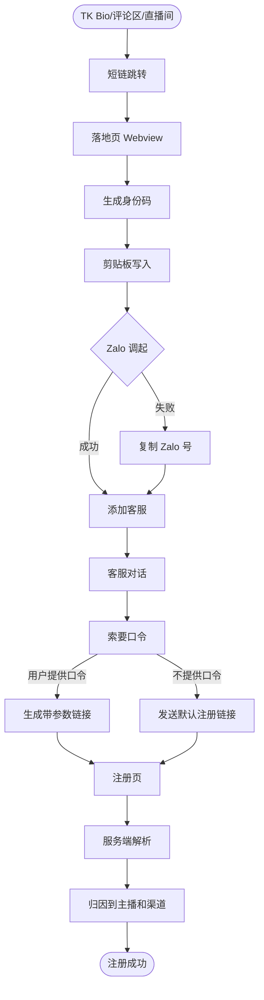
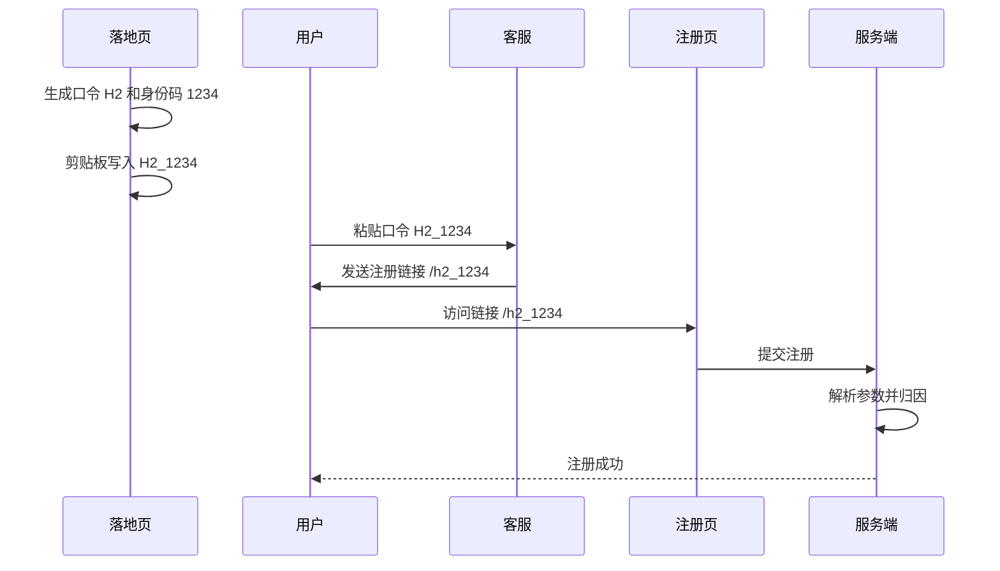
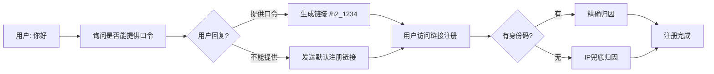
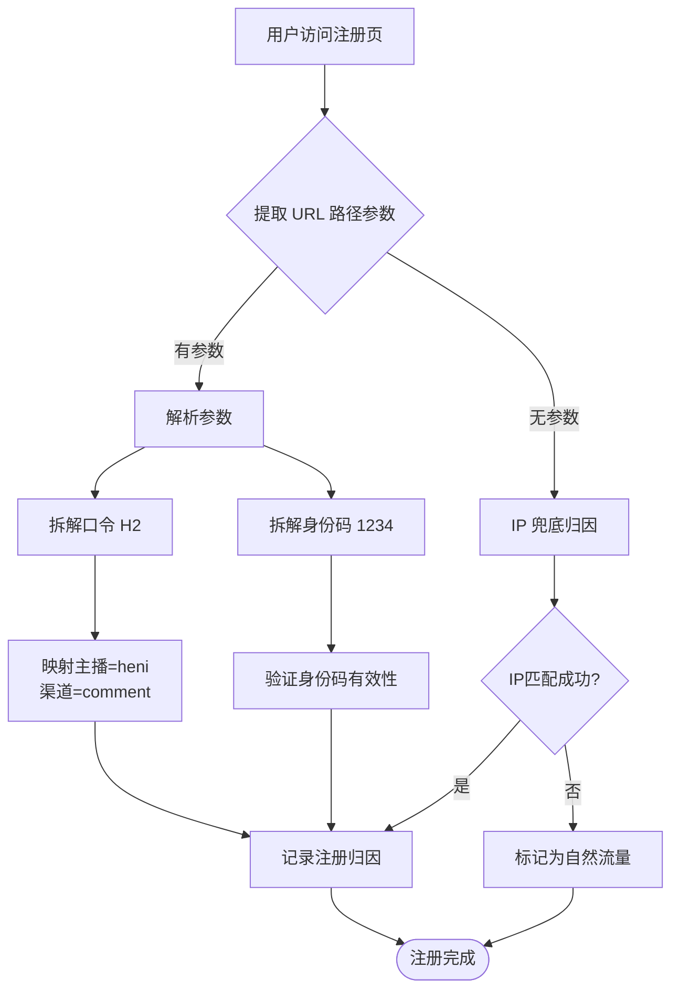

# TK 引流到注册完整链路 PRD

> **文档状态**: 已完成  
> **更新日期**: 2026-04-08  
> **关联项目**: 001-growNewUsers/001-03-landing-page  

---

## 1. 流程概览



---

## 2. 短链系统

### 2.1 编码规则

**编码格式**: `{主播字母}{渠道数字}`

**主播编码**:

| 编码 | 主播 |
|------|------|
| H | 阿贤heni |
| R | 志青Ricon |
| C | 阿园Chua |
| M | MYMY |
| P | Pink |
| E | peo |
| V | Vanie |
| U | Unknown |

**渠道编码**:

| 编码 | 渠道 |
|------|------|
| 1 | 个人主页 Bio |
| 2 | 评论置顶 |
| 3 | 视频描述 |
| 4 | 直播间 |

### 2.2 示例短链

| 短链 | 解析 | 场景 |
|------|------|------|
| `dkl.vn/h1` | 阿贤heni + 主页 | Bio链接 |
| `dkl.vn/h2` | 阿贤heni + 评论 | 评论区置顶 |
| `dkl.vn/r1` | 志青Ricon + 主页 | Bio链接 |
| `dkl.vn/m2` | MYMY + 评论 | 评论区置顶 |

### 2.3 跳转目标

用户访问短链后，服务端返回 302 跳转，目标地址携带来源参数：

```
用户访问: https://dkl.vn/h1
       ↓  [服务端 302 跳转]
目标地址: https://account.monster-lair.vn/landing-official/index.html
          ?source=tiktok
          &anchor=heni
          &channel=profile
          &ref=tiktok_heni_profile
```

---

## 3. 落地页

### 3.1 核心功能

| 功能 | 说明 | 技术实现 |
|------|------|----------|
| 身份码生成 | 4位随机数字，与口令绑定 | 服务端生成，用户访问时生成 |
| 口令生成 | 页面加载时自动生成 | 格式: `{主播字母}{渠道数字}` |
| 剪贴板写入 | 自动复制"口令_身份码" | 如: `H2_1234` |
| 剪贴板兜底 | 失败时弹窗展示口令_身份码 | 弹窗内可一键复制 |
| Zalo调起 | 点击调起Zalo应用 | 使用 `zalo://qr?...` 协议 |
| 复制Zalo号 | 备用方案 | 调起失败时展示Zalo号 |

### 3.2 剪贴板内容格式

```
H2_1234
```

- 对用户而言是**统一口令**，格式为 `口令_身份码`
- 客服工具可解析拆分，但用户只需复制整体发送

### 3.3 剪贴板失败兜底弹窗

```
┌─────────────────────────────────────────┐
│ ⚠️ 复制失败                             │
│                                         │
│ 请手动复制下方口令：                     │
│ ┌───────────────────────────────────┐  │
│ │ H2_1234                           │  │
│ └───────────────────────────────────┘  │
│                                         │
│ [复制口令] [打开Zalo]                  │
│                                         │
│ 💡 添加好友后发送此口令领取礼包！        │
└─────────────────────────────────────────┘
```

### 3.4 事件埋点

| 事件 | 时机 | 参数 |
|------|------|------|
| `page_view` | 页面加载 | `ref`, `source`, `anchor`, `channel` |
| `identity_code_generated` | 身份码生成 | `identity_code`, `ref` |
| `clipboard_write_attempt` | 尝试写入剪贴板 | `code`, `identity_code` |
| `clipboard_write_success` | 剪贴板写入成功 | `code`, `identity_code` |
| `clipboard_write_fail` | 剪贴板写入失败 | `code`, `identity_code` |
| `zalo_launch_attempt` | 点击调起 | `ref`, `webview_type` |
| `zalo_launch_success` | 调起成功 | `ref`, `time_to_success` |
| `copy_number` | 点击复制Zalo号 | `ref`, `method` |

---

## 4. Zalo 客服流程

### 4.1 正常流程（用户提供口令_身份码）



### 4.2 兜底流程（用户未发口令/身份码）



### 4.3 客服工具输入要求

客服获取用户提供的内容，直接透传给注册链接：

| 场景 | 用户输入 | 生成链接 | 备注 |
|------|----------|----------|------|
| 理想情况 | `H2_1234` | `/h2_1234` | 精确归因 |
| 仅口令 | `H2` | `/h2` | IP兜底归因 |
| 完全未知 | (无) | 默认链接 | 视为自然流量 |

**注意**: 客服工具只做参数透传，不解析口令含义。服务端负责解码和归因。

### 4.4 注册链接格式

**用户提供口令+身份码时**（推荐，归因精确）:
```
https://account.monster-lair.vn/#/register/H2_1234
```

**用户仅提供口令时**（兜底，归因模糊）:
```
https://account.monster-lair.vn/#/register/H2
```

**完全未知时**（自然流量）:
```
https://account.monster-lair.vn/#/register
```

**路径参数说明**:
- 路径格式: `/register/{口令}_{身份码}` 或 `/register/{口令}`
- 有身份码: 服务端精确归因到具体用户
- 无身份码: 服务端尝试 IP 兜底归因
- 无参数: 视为自然流量

---

## 5. 服务端解析逻辑

### 5.1 归因流程



---

## 6. 异常处理

| 场景 | 处理方案 |
|------|----------|
| 身份码生成失败 | 页面提示刷新重试 |
| 剪贴板写入失败 | 弹窗展示口令_身份码，用户手动复制 |
| Zalo调起失败 | 展示Zalo号，用户手动添加 |
| 用户只发口令不发身份码 | 客服工具兼容解析（提示补充身份码） |
| 用户不发口令/身份码 | 客服发送默认注册链接（无参数） |
| code参数格式错误 | 服务端返回错误，尝试IP兜底 |
| IP匹配失败 | 标记为自然流量，不计入渠道 |

---

## 7. 变更记录

| 版本 | 日期 | 变更 |
|------|------|------|
| v1.0 | 2026-04-08 | 初版：完整链路PRD |
| v1.1 | 2026-04-08 | 新增身份码机制，修改链接格式为 code=口令_身份码 |
| v1.2 | 2026-04-08 | 客服工具改为双输入框设计（验证码风格），支持粘贴自动拆分 |
| v1.3 | 2026-04-08 | 按飞书表格规范优化表格格式 |
