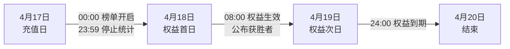
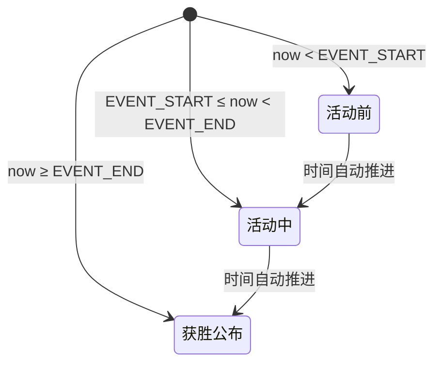

# 「Chí Tôn Long Vương | 至尊龙王」活动 PRD

## 一、活动目的

- **核心目标**：拉动单日充值峰值，刺激大R玩家（鲸鱼用户）竞争消费
- **设计抓手**：通过"全服唯一头衔+限时特权+永久荣誉"制造稀缺性与炫耀需求；仅展示第一名金额（隐藏账号名）给追赶者施加竞争压力

## 二、活动介绍

- **活动名称**：Chí Tôn Long Vương / 至尊龙王（Long Vương Chiến - Vua Khủng Long）
- **活动类型**：单日充值排行榜
- **获奖名额**：仅1名（单日累计充值金额最高者）
- **核心权益**：
  - 所有恐龙体型 +50%
  - 所有恐龙咬合力 +100点
  - 每日登录时 GM 发送全服荣耀播报
  - 获胜者名字永久镌刻名人殿堂
- **权益有效期**：2天（每日 08:00-24:00，越南时间 UTC+7）

## 三、活动流程

### 3.1 运营时间线



### 3.2 页面状态流转

页面根据硬编码时间自动推进，无需人工切换：



| 状态 | 倒计时 | 榜单 | 规则/奖励 | 结果公布 | 名人殿堂 |
|------|--------|------|-----------|----------|----------|
| 活动前 | 距离开始 | 隐藏 | 显示 | 隐藏 | 隐藏 |
| 活动中 | 剩余时间 | 显示 | 显示 | 隐藏 | 隐藏 |
| 获胜公布 | 隐藏 | 隐藏 | 隐藏 | 显示 | 显示 |

### 3.3 获胜公布运营流程

```mermaid
flowchart LR
    A[活动结束<br/>系统结算排名] --> B[运营确认最终获胜者]
    B --> C[&#91;TODO&#93; 手动记录<br/>获胜者昵称]
    C --> D[配置昵称到<br/>结果公布区]
    D --> E[页面展示<br/>昵称+账号名+金额]
```



> **TODO**：当前系统仅记录账号名，结果公布区为展示荣誉需使用玩家昵称。运营需在确认获胜者后手动收集并记录昵称，再配置到页面静态数据中。

## 四、活动规则

1. **时间基准**：越南时间 UTC+7，以充值订单**支付成功时间**为准
2. **服务器范围**：Q服 + K服，同一账号跨服累计
3. **充值渠道**：仅统计官网直充，代充不计入
4. **排名规则**：金额高者胜；金额相同时，以先达到该累计金额的支付时间戳（毫秒级）判定
5. **顺延机制**：第一名拒绝权益或账号异常时，资格顺延至第二名，以此类推
6. **账号隐私**：活动期间榜单仅显示第一名金额，**隐藏所有账号名**；活动结束后结果公布区才展示获胜者信息
7. **权益发放**：GM 单独拉群，用户需主动联系 GM 进行手动配置

## 五、技术方案

### 5.1 项目结构

```
src/campaign/pages/005-01-monthly-recharge-king/
├── index.html              # 活动主页面（三阶段视图 + 中越双语）
├── css/
│   └── main.css           # 暗金主题样式
├── js/
│   ├── main.js            # 语言切换、测试按钮
│   └── countdown.js       # 时间判断 + 三阶段自动切换
└── static/images/         # 视觉资源
```

### 5.2 关键技术点

| 模块 | 实现方式 |
|------|----------|
| **状态驱动** | `countdown.js` 硬编码 `EVENT_START` / `EVENT_END`（UTC+7），每秒判断当前时间，自动切换三阶段 DOM 显隐 |
| **双语切换** | `body[data-lang]` + CSS 控制 `lang-vi` / `lang-cn` 显隐，语言偏好持久化到 `localStorage` |

### 5.3 待接入事项

- 榜单与获胜者数据需替换为后端 API（当前为 Mock 硬编码）
- 获胜者昵称需运营手动确认后配置到静态页面
- Header 上的演示/测试按钮仅在开发验收阶段使用，正式上线前移除
