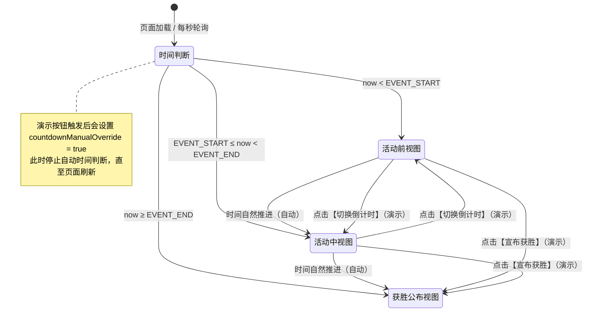

# 「Long Vương Chiến」活动页面设计规范

## 一、设计概述

### 1.1 页面清单

| 页面 | 文件名 | 功能 |
|------|--------|------|
| 活动主页面 | `index.html` | 充值排行榜、活动规则、结果公布 |

### 1.2 视觉风格定位

```
主题：越南龙王崇拜 × 史前恐龙霸主
氛围：神秘、威严、竞争激烈
色彩：
  - 主色：皇家金 #FFD700
  - 辅色：深红 #8B0000
  - 背景：深黑 #0A0A0A → 暗金渐变
  - 强调：龙焰橙 #FF4500
字体：
  - 标题：粗体无衬线
  - 数字：等宽字体
```

### 1.3 静态资源清单

**需从 public 复制到项目目录：**

```
static/
└── images/
    ├── bg-forest-snow.jpg      # 森林雪山背景
    ├── dino-tyrannosaurus.png  # 霸王龙
    ├── dino-mechanical.png     # 机械霸王龙
    └── logo-dragon.png         # 龙logo
```

---

## 二、页面结构

```
┌─────────────────────────────────────────┐
│              Header                     │
├─────────────────────────────────────────┤
│                                         │
│           Hero Section                  │
│      主标题 + 活动倒计时                 │
│                                         │
├─────────────────────────────────────────┤
│                                         │
│           Rank Section                  │
│      第一名展示区 + 你的位置             │
│                                         │
├─────────────────────────────────────────┤
│                                         │
│           Rules Section                 │
│         活动规则 + 奖励展示              │
│                                         │
├─────────────────────────────────────────┤
│                                         │
│        Result Section（结果公布）        │
│      活动结束显示，含荣誉殿堂简化版       │
│                                         │
├─────────────────────────────────────────┤
│              Footer                     │
└─────────────────────────────────────────┘
```

---

## 三、模块详细设计

### 3.1 Hero Section

**布局：** 全屏高度或 80vh，暗金渐变背景

**内容：**
```
主标题：LONG VƯƠNG CHIẾN / 龙王之战
副标题：VUA KHỦNG LONG - 恐龙之王
倒计时：Còn lại: XX giờ XX phút XX giây
```

---

### 3.2 Rank Section - THE KING

**设计：** 金色边框卡片，居中展示

```
┌─────────────────────────────────────┐
│              👑                     │
│         NGAI VÀNG ĐANG CHỜ         │
│            王座虚位以待              │
│                                     │
│    当前最高金币数                      │
│    [隐藏玩家名]                     │
│    88,888,000 🪙                   │
│    ▲ 动态滚动效果                   │
│                                     │
│    "Bạn có thể vượt qua không?"    │
│        你能超越吗？                  │
└─────────────────────────────────────┘
```

---

### 3.3 Rank Section - YOUR POSITION

**状态1：未登录**
```
🔒 Đăng nhập để xem / 登录查看排名
[登录按钮]
```

**状态2：已登录**
```
🎯 VỊ TRÍ CỦA BẠN / 你的位置

Xếp hạng: #3 / 排名：第3名
Số tiền nạp: 52,000,000 🪙 / 充值金币数
─────────────────────
Cách #1 còn: 36,888,000 🪙 / 距离第1名还差
[████████████░░░░░░ 58%]
```

---

### 3.4 Rules Section

**规则卡片：**
```
THỂ LỆ HOẠT ĐỘNG / 活动规则

⏰ Thờ gian: 18/04/2026 00:00 - 23:59 (UTC+7)
🌐 Phạm vi: Máy chủ Quân Đoàn Chiến (Q服) + Khủng Long Chi Chiến (K服), Tích lũy theo tài khoản
💳 Kênh nạp: Chỉ tính nạp qua website
🏆 Cơ chế: Số tiền cao nhất thắng, bằng nhau ưu tiên đạt trước
```

**奖励展示：**
```
🎁 PHẦN THƯỞNG / 奖励内容

ĐẶC QUYỀN LONG VƯƠNG / 龙王特权
(Duy nhất 1 ngườ - 2 ngày)

✓ Kích thước +50% / 体型增加50%
✓ Lực cắn +100 / 咬合力+100点
✓ Danh hiệu 「Long Vương」
✓ Ghi danh Điện Thờ Long Vương
```

---

### 3.5 Result Section（结果公布区）

**显示条件：** 活动结束后

```
┌─────────────────────────────────────────────┐
│                                             │
│           🏆 KẾT QUẢ CÔNG BỐ               │
│              结果公布                        │
│                                             │
│   ┌─────────────────────────────────────┐  │
│   │                                     │  │
│   │         🏆 ĐIỆN THỜ LONG VƯƠNG     │  │
│   │            龙王神殿（第一届）         │  │
│   │                                     │  │
│   │              👑                     │  │
│   │                                     │  │
│   │        Long Vương Đầu Tiên         │  │
│   │           第一任龙王                 │  │
│   │                                     │  │
│   │         [PlayerABC]                │  │
│   │                                     │  │
│   │       88,888,000 🪙               │  │
│   │        18/04/2026                  │  │
│   │                                     │  │
│   └─────────────────────────────────────┘  │
│                                             │
│   "Vị trí này đang chờ chủ nhân tiếp theo" │
│     这个位置正等待着下一任主人...           │
│                                             │
└─────────────────────────────────────────────┘
```

**卡片设计：**
- 深底金色边框
- 皇冠图标居中
- 玩家账号名活动结束才显示
- 金币数和日期小字号
- 底部预留第二届位置提示

---

### 3.6 页面状态切换（时间自动驱动）

页面三阶段状态**完全由硬编码的活动时间自动推进**，无需外部配置或服务端下发。只要 `EVENT_START` 和 `EVENT_END` 设置准确，页面会自动走完完整流程：

> **活动前 → 活动中 → 获胜公布**

#### 时间判断逻辑

`countdown.js` 每秒将当前时间与以下两个硬编码时间点比较（越南时间 UTC+7）：

```javascript
const EVENT_START = new Date('2026-04-17T00:00:00+07:00').getTime();
const EVENT_END   = new Date('2026-04-17T23:59:59+07:00').getTime();
```

| 当前时间条件 | 页面状态 | 显示内容 |
|--------------|----------|----------|
| `now < EVENT_START` | **活动前** | 显示"距离开始"倒计时，榜单隐藏 |
| `EVENT_START ≤ now < EVENT_END` | **活动中** | 显示"剩余时间"倒计时，榜单开启 |
| `now ≥ EVENT_END` | **获胜公布** | 隐藏倒计时和榜单，显示获胜者卡片与名人殿堂 |

#### 状态切换流程图



#### 演示/测试按钮（Header）

为方便开发和运营演示，页面右上角提供两个手动切换按钮。它们仅用于**本地测试/验收**，不应出现在正式生产环境：

| 按钮 | 触发函数 | 演示用途 |
|------|----------|----------|
| **切换倒计时** | `toggleCountdownMode()` | 在活动前倒计时 ↔ 活动中倒计时之间切换，同时控制榜单显隐 |
| **宣布获胜 / 查看活动** | `toggleResult()` | 手动切换到获胜公布视图，或切回活动视图 |

**注意**：手动点击后会设置 `window.countdownManualOverride = true`，阻止自动时间判断覆盖当前演示状态。刷新页面后恢复时间自动判断。

---

## 四、响应式设计

| 设备 | 宽度 | 调整 |
|------|------|------|
| 桌面 | >1200px | 完整布局 |
| 平板 | 768-1200px | 两栏 |
| 手机 | <768px | 单栏堆叠 |

---

## 五、文件结构

```
projects/005-recharge/005-01-月巅峰充值榜/
├── index.html              # 活动主页面
├── css/
│   └── main.css           # 样式
├── js/
│   ├── main.js            # 主逻辑
│   └── countdown.js       # 倒计时
└── static/
    └── images/            # 静态资源
```
